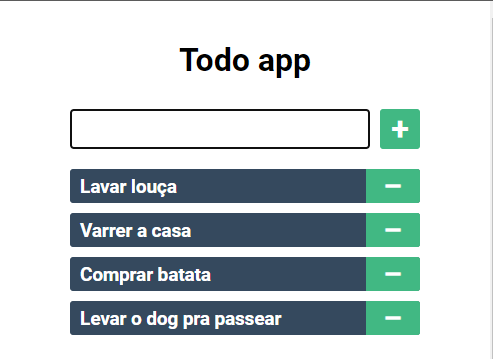

<h1 align="center" style="font-weight: bold;">
  Todo app - Vue
</h1>

  <a href="#-projeto">Projeto</a>&nbsp;&nbsp;&nbsp;|&nbsp;&nbsp;&nbsp;
  <a href="#-tecnologias">Tecnologias</a>&nbsp;&nbsp;&nbsp;|&nbsp;&nbsp;&nbsp;
  <a href="#-como-executar">Como executar</a>

  

---

## 💻 Projeto

Este projeto foi utilizado para demonstrar o básico de como se utiliza o vuejs, demonstrando como criar o projeto com vue cli, como usar o two way data bindig, transmitir dados entre componente pai e componente filho, dentro outras características do vue.

## ✨ Tecnologias

Esse projeto foi desenvolvido com as seguintes tecnologias:

- [Vue](https://vuejs.org/)

## 🚀 Como executar

- Clone o repositório
- Instale as dependências com `yarn` ou `npm i`
- Inicie o servidor com `yarn serve` ou `npm run serve`